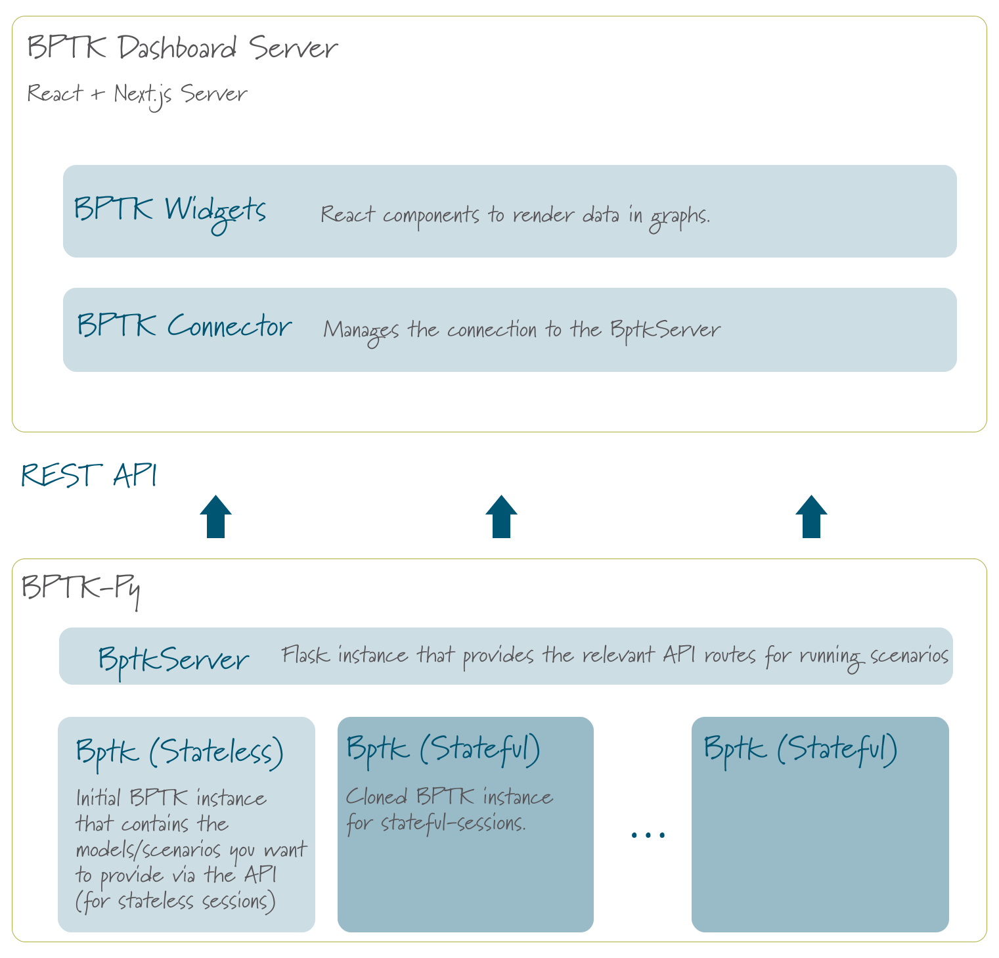

# Building Web-based Simulations with BPTK

This directory contains the code for a simple web-based simulation dashboard for the customer acquisition simulation.



The dashboard was built using the following Javascript-based technology stack:

* [Next.js](https://nextjs.org/learn) to build and run the site
* [React.js](https://reactjs.org) as the framwork for rendering web pages
* The [BPTK Widgets Library](https://www.npmjs.com/package/@transentis/bptk-widgets) library to render the dashboards
* Tbe [BPTK connector library](https://www.npmjs.com/package/@transentis/bptk-connector) to manage the connection to the actual simulation server.


The dashboard requires a bptk simulation server to be running that serves the actual simulation model. You can find the code for that model in the [REST-API directory](../rest-api), along with instructions on how to start the server. Make sure you have the simulation running even at build time, because next.js renders pages that can be pre-calculated statically.

## Getting Started

First make sure you have installed all relevant node modules:

```bash
yarn install
```


Then run the development server:

```bash
yarn dev
```

Open [http://localhost:3000](http://localhost:3000) with your browser to see the result.

You can start editing the page by modifying `pages/index.tsx`. The page auto-updates as you edit the file.

Once everything is working you can create a relase build:

```bash
yarn build
```

The release build is much faster because it containts pre-rendered, static files – e.g the homepage is built statically along with the data. You can see this because the dashboard runs happily even when the backend isn't running and displays the initial data. As soon as you then try to switch scenarios, the frontend makes it's first live call to the backend to get the data for that scenario.

Once the release build is finsihed, you can start the release dashboard server using:

```bash
yarn start-local
```

The server should now be running on [http://localhost:3000](http://localhost:3000).


## Further Reading

You can find extensive [documentation](https://bptk.transentis.com) online and advanced tutorials and examples on [GitHub](https://github.com/transentis/).

You can also find more advanced examples on GitHub:

-   [COVID Simulation](https://github.com/transentis/sim-covid-19). Jupyter notebooks and dashboards illustrating the SIR model.
-   [COVID Simulation Dashboard](https://github.com/transentis/sim-covid-dashboard). A web-based simulation dashboard for the COVID simulation built using our BPTK Widgets library for Javascript. View a [live version](http://www.covid-sim.com) of the dashboard online.
-   [Beer Distribution Game](https://github.com/transentis/beergame). In-depth analysis of the beergame using both System Dynamics and Agent-based simulation. Includes an illustration of how to use BPTK in conjunction with reinforcement learning to train agents to play the beergame autonomously.


